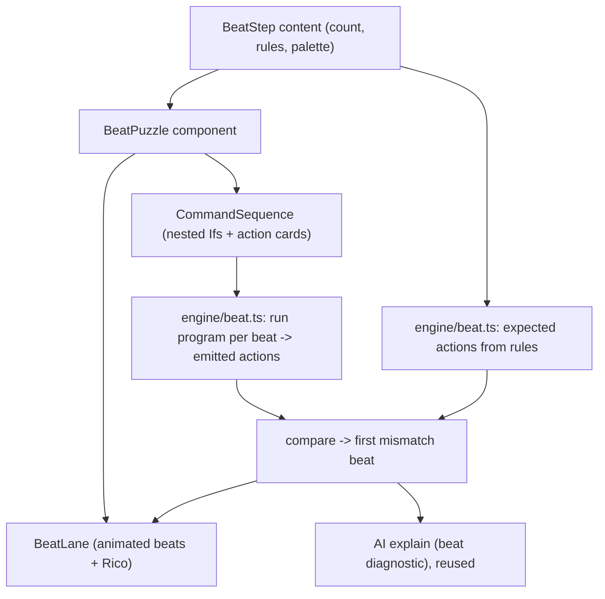

# Design: "Dodge the Beat" - a rhythm puzzle style for FizzBuzz

## Purpose

Replace the board-based FizzBuzz puzzle (`c7-fizzbuzz` in [src/content/lessons/lesson7.ts](src/content/lessons/lesson7.ts)) with a puzzle style where the beat is *felt*, not just narrated. Rico no longer walks a grid; the count ticks like a metronome and beats arrive at him, and the learner's program decides his action on each beat. The original teaching goal is preserved: the divide-by-3-and-5 "both beat" trap forces nesting one If inside another.

Built as a **reusable step type** so it also serves other counting concepts later (Fizz-only, even/odd chants, count-by-N) with content data, no new code.

## Validated decisions (from brainstorming)

- Framing: **Dodge the beat** - beats fly in on a pulse; the right action avoids a hit.
- Control: **Programmed (build then watch)** - drag nested Ifs + a Repeat with action cards, press Play, Rico auto-runs the rule against the beats. Keeps the nested-If learning goal.
- Feedback: **Mark + retry** - the run stops at the first wrong beat, highlights it, Rico explains it (reusing the AI explain feature). No lives, no grind.
- Scope: **Reusable `beat` step type** driven by content.
- Layout: Brillant lesson shape (Rico guide + workspace); beat lane on top replaces the map; nested-If editor below.

## Action mapping (FizzBuzz content)

The count drives a required action per beat, first-match wins:

- count divisible by 15 -> SUPER (FizzBuzz)
- count divisible by 3 -> DASH (Fizz)
- count divisible by 5 -> SHIELD (Buzz)
- otherwise -> HOLD

The learner must reproduce this with a nested If (ask div-by-3, inside ask div-by-5) inside a Repeat.

## Architecture

Design for isolation: the beat puzzle is a self-contained `BeatPuzzle` component (its own run/animate/check/explain state), rendered by `LessonPage` when `step.type === 'beat'`. This avoids entangling the movement-specific lesson logic.

## Components and files

- [src/types.ts](src/types.ts): add `BeatAction` (e.g. `'dash' | 'shield' | 'super' | 'hold'`), a `BeatRule` (`{ predicate: Predicate; action: BeatAction }`), and a `BeatStep` (`type: 'beat'`, `count`, `rules`, `availableActions`, `blocks`, `predicateOptions`, `loopRange`, `feedback`, `solution`, action labels/colors). Add to the `LessonStep` union and an `isBeatStep` guard.
- New `src/engine/beat.ts`:
  - `expectedActions(step): BeatAction[]` - the deterministic ground truth from `rules` over `0..count-1` (the "subject logic").
  - `runBeatProgram(step, instructions): BeatAction[]` - a small interpreter: for each beat the counter is the beat index, evaluate the nested Ifs/Repeat with the existing counter predicates, and collect the emitted action-leaf. Reuses `evalPredicate` semantics where possible.
  - `checkBeatProgram(step, instructions): { correct, firstWrongBeat, expected, got }` - compares; the engine, never the LLM, is the authority.
- New `src/components/BeatLane.tsx`: the animated lane (beats flowing toward Rico, special beats colored, current-beat HUD, hit marker on the failing beat). Reduced-motion safe.
- New `src/components/BeatPuzzle.tsx`: self-contained player - `CommandSequence` editor with action-card palette + If/Repeat, Play/Reset, `BeatLane`, `BirdGuide` (Rico delivers the explanation), and `getExplanation` reuse for misses.
- [src/pages/LessonPage.tsx](src/pages/LessonPage.tsx): render `<BeatPuzzle step={currentStep} .../>` when `step.type === 'beat'` (a new branch alongside concept/sequence/conditional).
- [src/content/lessons/lesson7.ts](src/content/lessons/lesson7.ts): convert `c7-fizzbuzz` to a `beat` step and update the `c7-fizzbuzz-intro` concept copy to describe dodging the beat.
- AI explain: a beat diagnostic ("expected SHIELD on beat 5, your rule did DASH") feeding the existing [src/ai/explain.ts](src/ai/explain.ts) flow, with the solution withheld/guarded as today.

## CommandSequence reuse

The editor already supports nested loops/ifs and "action" cards and predicate options. Add beat actions to its palette (a new `kind: 'action'` set or a `beat-action` node kind) and offer the div-by-3 / div-by-5 predicate options. Convert its node tree to `Instruction[]` for the beat interpreter (leaves are beat actions instead of moves).

## Error handling and parity

- The engine is the sole authority on correctness; AI only phrases the miss.
- Reduced-motion: the lane animation respects `prefers-reduced-motion` (falls back to a stepped reveal).
- This is authored content (no AI required to play); the AI explain piece degrades to the authored hint when AI is off, exactly like the move puzzles.

## Testing

- `engine/beat.ts`: `expectedActions` for FizzBuzz over 0..15 (covering the both-beat trap); `runBeatProgram` for a correct nested-If solution returns the expected sequence; a naive side-by-side rule fails at beat 0/15; `checkBeatProgram` reports the correct `firstWrongBeat`.
- Content registry validation: the FizzBuzz beat step's `solution` passes `checkBeatProgram`.
- Component smoke test: `BeatPuzzle` renders, Play animates, a wrong rule surfaces the failing beat.

## Out of scope (for this build)

- Live-reflex/tap play and a health/lives system.
- Generating beat puzzles with AI (could come later via the same rules schema).
- Sound design beyond reusing existing `playSound` cues.
